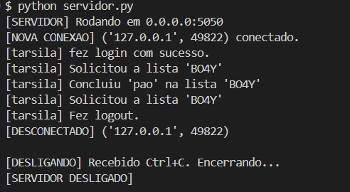
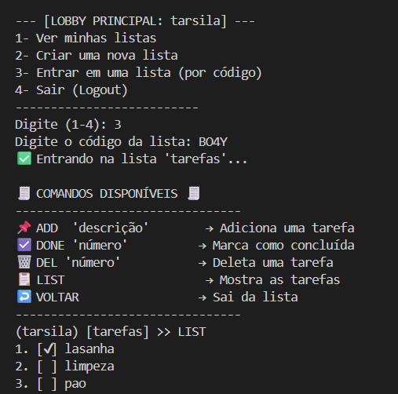
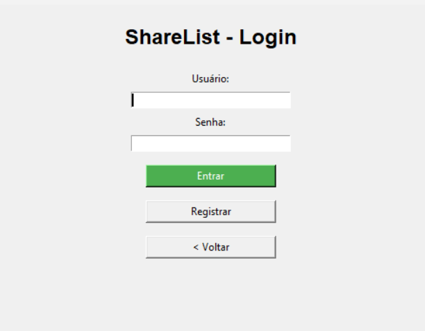
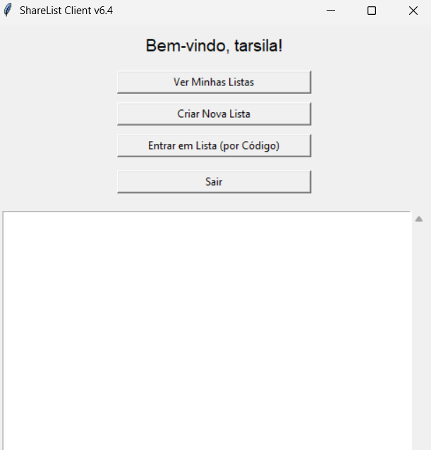
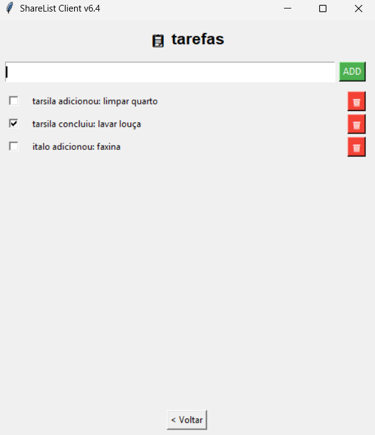

# 🧩 ShareList — Lista de Tarefas Compartilhada via TCP

> Projeto 1 — Redes de Computadores (UnB - 2025.2)  
> Professora: **Priscila Solís Barreto**  
> Grupo: Tarsila Marques, Yasmim Sousa e Mateus Santos

---

## 🧠 Sobre o Projeto

**ShareList** é uma aplicação de rede construída na **arquitetura cliente-servidor**, que permite que vários usuários acessem **uma lista de tarefas compartilhada em tempo real**, através de **comunicação via protocolo TCP**.

O objetivo do projeto é compreender o funcionamento dos **sockets TCP**, o **encapsulamento das camadas de rede** e a **troca de mensagens entre entidades cliente e servidor**.

---

## ⚙️ Arquitetura do Sistema

### 🖥️ Servidor
- Mantém a lista de tarefas compartilhada.  
- Gerencia conexões de múltiplos clientes.  
- Garante a sincronização entre todos os usuários conectados.  

### 📱 Cliente
- Permite ao usuário:
  - Adicionar tarefas 📝  
  - Listar tarefas 📋  
  - Marcar tarefas como concluídas ✅  
  - Excluir tarefas ❌  

A comunicação é feita por **mensagens de texto via sockets TCP**.

---

## 💬 Protocolo de Comunicação

| Ação | Mensagem do Cliente | Resposta do Servidor |
|------|----------------------|----------------------|
| Adicionar tarefa | `ADD Comprar pão` | `OK Tarefa adicionada` |
| Listar tarefas | `LIST` | `1 - Comprar pão\n2 - Lavar roupa` |
| Concluir tarefa | `DONE 1` | `OK Tarefa 1 concluída` |
| Excluir tarefa | `DEL 2` | `OK Tarefa 2 removida` |
| Sair | `EXIT` | `BYE` |

**Protocolo de transporte:** TCP  
**Porta padrão:** 5050  

---

## 🧩 Fluxo de Funcionamento

```plaintext
CLIENTE                SERVIDOR
   |                        |
   | ---- Conexão TCP ----> |
   | <--- Confirmação ----- |
   | ---- ADD tarefa ------>|
   | <--- OK resposta ------|
   | ---- LIST ------------>|
   | <--- Tarefas ----------|
   | ---- EXIT ------------>|
   | <--- BYE --------------|
````
---

## 🧪 Testes e Análise de Rede

Para análise do protocolo, foi utilizada a ferramenta Wireshark.
No relatório, foram respondidas as perguntas do Quadro 1 com base nas capturas de pacotes.

**Comandos úteis:**
```bash
ipconfig   # Ver IP no Windows
ifconfig   # Ver IP no Linux/Mac
```

---

## 📚 Tecnologias Utilizadas
* **Python** (sockets TCP, threading)
* **Wireshark** (captura de pacotes)
* **Tkinter** (interface gráfica)
* **JSON / TXT** (armazenamento local de dados)

---

## 🚀 Como Executar o Projeto

### 🖥️ Requisitos
* Python 3.10+
* Wireshark (para análise)
* Rede TCP funcional (mesmo Wi-Fi ou via IP público)

---

## ▶️ Passos

### 1️⃣ Iniciar o servidor
```bash
python servidor.py #Sem interface
python server-gui.py #Com interface
```

### 2️⃣ Iniciar o cliente
```bash
python cliente.py #Sem Interface
python cliente_gui.py #Com Interface
```
### 3️⃣ Conectar usando o IP do servidor e a porta 5050.

---

## 🎥 Demonstração em Vídeo

### 📺 [Confira o vídeo](https://youtu.be/6wb25eIqKb0?si=DPRAI0Cf121pTxeG)

* A **implementação** e o **funcionamento** do servidor.
* A conexão de **dois clientes** (com e sem interface).
* A comunicação via TCP.
* A atualização da lista em tempo real.
* A **obtenção e análise** dos pacotes no Wireshark, respondendo ao Quadro 1.

---

## 📸 Telas da Aplicação

<p align="center">
  <strong>Servidor em Execução (Terminal)</strong><br>
  
</p>

<p align="center">
  <strong>Cliente "sem interface" Conectado (Terminal)</strong><br>
  
</p>

<p align="center">
  <strong>Cliente com Interface Gráfica (GUI)</strong>
</p>
<table align="center">
  <tr>
    <td align="center">
      <i>Tela de Login</i><br>
      
    </td>
    <td align="center">
      <i>Lobby de Listas</i><br>
      
    </td>
    <td align="center">
      <i>Lista Compartilhada</i><br>
      
    </td>
  </tr>
</table>

---

## 👩‍💻 Autores

<table align="center">
  <tr>
    <td align="center">
      <a href="https://github.com/Yasmimsousac">
        
        <br />
        <sub><b>Yasmim Sousa</b></sub>
      </a>
    </td>
    <td align="center">
      <a href="https://github.com/DeveloperMateusS">
        
        <br />
        <sub><b>Mateus Santos</b></sub>
      </a>
    </td>
    <td align="center">
      <a href="https://github.com/Tarsila07">
        
        <br />
        <sub><b>Tarsila Marques</b></sub>
      </a>
    </td>
  </tr>
</table>

---

## 🧾 Licença

Este projeto foi desenvolvido exclusivamente para fins educacionais na disciplina Redes de Computadores – UnB.

